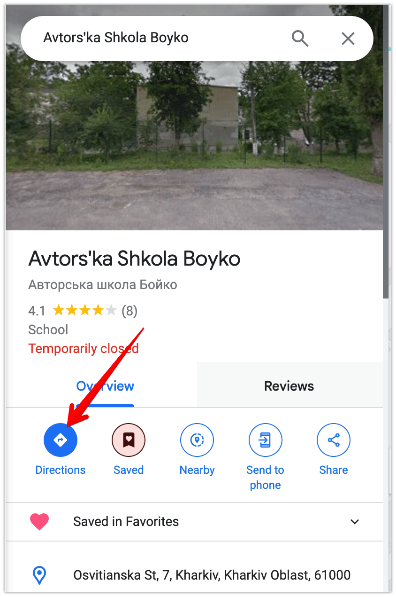

# Google Maps

Мета урока навчитися користуватися Google картами.

- Шукати місця за назвою чи за адресою
- Додавати місця в улюблені
- Прокладати маршрут та додавати проміжні зупинки
- Ділитися маршрутом
- Ділитися своїм місцезнаходженням

На уроці тобі знадобиться телефон чи планшет з активованим Google-акаунтом. Та застосунок Google Maps:
- [Для iPhone чи iPad](https://apps.apple.com/us/app/google-maps/id585027354)
- [Для Android](https://play.google.com/store/apps/details?id=com.google.android.apps.maps&hl=en)

Або комп'ютер чи ноутбук з відкритим сайтом [Google Maps](https://maps.google.com/) де також виконано вхід до Google-акаунта

## Завдання

1. Знайди за назвою `Авторська Школа Бойко`
1. Додати школу до `Favorites`
    

      
Клікни сюди щоб побачити скріншоти

      
      
    

1. Проклади маршрут до школи зі свого поточного місце знаходження
    

      
Клікни сюди щоб побачити скріншоти

      
      
      
    

1. Додай ще одну зупинку за адресою вчителя
    

      
Клікни сюди щоб побачити скріншоти

      
      
    

1. Перетягни Школу так щоб вона стала останньою
    

      
Клікни сюди щоб побачити скріншоти

      <video src="./screenshots/Drag-stop.mov">
    

